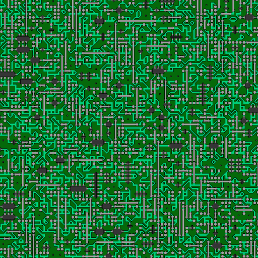
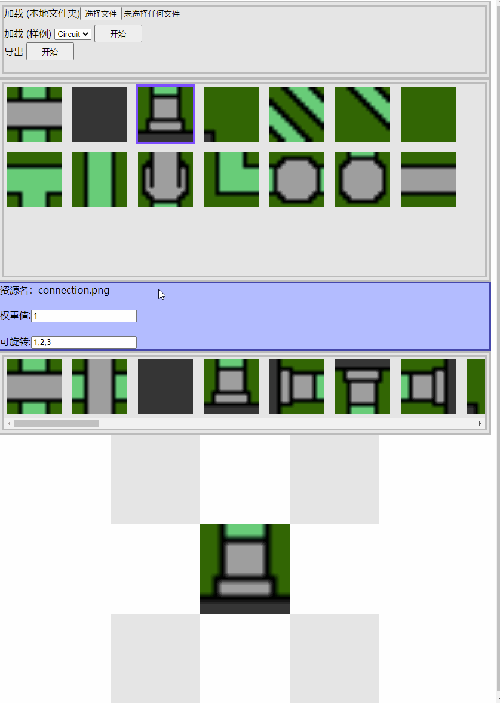

# wfc2D
## 说明
通过波函数坍塌（Wave Function Collapse）算法，生成 2d 地图。

[](https://anseyuyin.github.io/wfc2D/demos/2DMapExample/)

### Demos
- [样例](https://anseyuyin.github.io/wfc2D/demos/2DMapExample/) 
- [算法过程可视化](https://anseyuyin.github.io/wfc2D/demos/algorithmVisualization/) 
- [无限地图](https://anseyuyin.github.io/wfc2D/demos/endlessMap/build/web-mobile/) 
- [无限小镇](https://anseyuyin.github.io/wfc2D/demos/endlessTown/build/web-mobile/) 
  
  [](https://anseyuyin.github.io/wfc2D/demos/endlessTown/build/web-mobile/)
### tools
- [编辑工具](https://anseyuyin.github.io/wfc2D/demos/2DMapEditor/) 
## 快速开始
- ##### 准备好演算数据
    获取方式一：直接测试样例 [res/samples/*](https://github.com/anseyuyin/wfc2D/blob/main/res/samples/)

    获取方式二：准备一个放置好素材的文件夹 ==> 使用 "[瓦片编辑器](https://github.com/anseyuyin/wfc2D/blob/main/demos/2DMapEditor/README.md) 打开编辑 ==> 保存

- ##### 在浏览器中使用
````html
//html 中加载js 文件
<script src="wfc2D.js"></script>
````
````javascript
//得到配置对象 (xxxloadJson 替换成自己的加载json的函数)
var jsonConf = xxxloadJson(`xxx/data.json`);
//创建 WFC2D
var wfc2d = new WFC.WFC2D(jsonConf);
//设定地图尺寸
var mapWidth = 100;
var mapHeigth = 100;
//计算生成 地图数据 ，返回数据类型 数组 [[string,number],.....]
var resultMap = wfc2d.collapse(mapWidth, mapHeigth);

//绘制地图的每个瓦片
var count = 0;
for (var y = 0; y < mapWidth; y++) {
    for (var x = 0; x < mapHeigth; x++) {
        var imgData = resultMap[count];
        //图片资源名 , 类型 string
        var imgName:  = imgData[0];
        //图片顺时针旋转次数（每次90度）, 类型 number 
        var rotate = imgData[1];
        //绘制 一个 瓦片到容器  (xxxDrawTile 替换成自己的绘制函数)
        xxxDrawTile(x , y , imgName , rotate);
    }
}

````
- ##### 预设条件功能
````javascript
//加载一个配置资源
var jsonConf = xxxloadJson(`https://anseyuyin.github.io/wfc2D/res/samples/Circuit/data.json`);
var wfc2d = new WFC.WFC2D(jsonConf);
//在求解前 预先设置部分位置瓦片的已经知道的条件
//例如：左上 2个方块，预先设置为 绿色块。
var known = [{x:0,y:0,tiles:["substrate",0]},{x:1,y:0,tiles:["substrate",0]}];
wfc2d.setKnown(known);


````


## 瓦片编辑器
[<编辑器链接>](https://anseyuyin.github.io/wfc2D/demos/2DMapEditor/)

[](https://anseyuyin.github.io/wfc2D/demos/2DMapEditor/)

## 参考

- [mxgmn/WaveFunctionCollapse](https://github.com/mxgmn/WaveFunctionCollapse)

