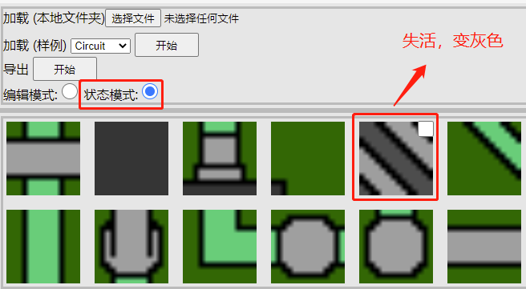
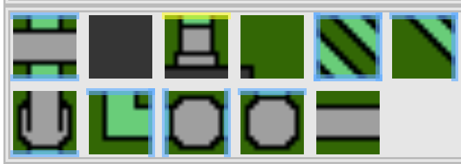

# 瓦片编辑器
[编辑器链接](https://anseyuyin.github.io/wfc2D/demos/2DMapEditor/)
### 编辑器使用：

- ##### 准备素材的文件夹


- ##### 载入编辑的素材资源


- ##### 编辑素材资源


- ##### 激活状态切换
##### 失活的瓦片，导出后不会参与逻辑运算，也可便于瓦片边连接错误筛查。



- ##### 检查边的连接


- ##### 保存到本地


##### 保存的文件结构
```
 export.zip
    - data.json     //运行计算使用到的配置文件。
    - editor.json   //编辑器使用的配置文件。
    - images        //瓦片图片资源。
```
